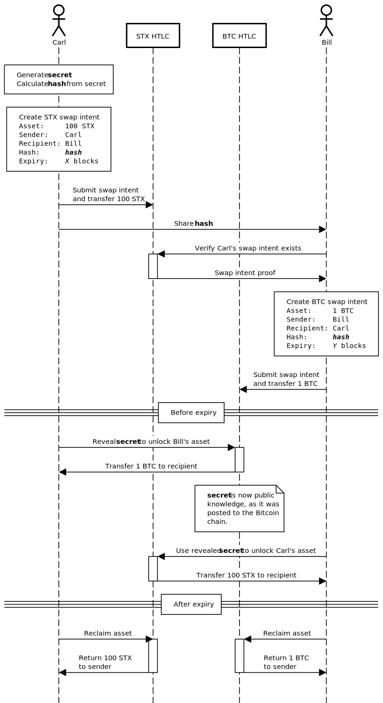

# Stacks <> Bitcoin & Ethereum atomic swaps

A proof of concept for atomic swaps between Stacks <> Bitcoin, and Stacks <> Ethereum (EVM chains).

Supported swaps:
- STX, SIP009 NFTs, SIP010 fungible tokens <> BTC.
- STX, SIP009 NFTs, SIP010 fungible tokens <> ETH, ERC721 NFTs, ERC20 fungible tokens.

The project contains Hashed Timelock Contract (HTLC) implementations in Clarity, Bitcoin Script, and Solidity. It features individual unit tests as well as integration tests that trigger swaps between the different chains.

# How to use

First, install dependencies using `npm install`. The Stacks, Bitcoin, and Ethereum project files are found in their respective directories (`./stx`, `./btc`, `./eth`). You need to have `clarinet` and `bitcoind` in your `PATH` in order to run integration tests. (You can also symlink `Bitcoin-Qt` to `bitcoind`.)

To run integration tests, simply run `npm test`. The chains will automatically be started and prepared for test.

- Stacks tests run on a Clarinet session. (Tested up to version 0.15.2.)
- Bitcoin tests run on regtest.
- Ethereum tests run on a Ganache session.

The individual project directories also have their own unit tests.

- `npm run stx-test` to test the Clarity contracts.
- `npm run eth-test` to test the Solidity contracts. Be sure to start the test RPC first using `npm run eth-test-rpc`.

Integration tests:

```
  STX <> BTC
Starting STX and BTC chains...

    ✓ Can swap STX and BTC (436ms)
    ✓ Can swap SIP009 and BTC (377ms)
    ✓ Can swap SIP010 and BTC (391ms)
    ✓ BTC HTLC rejects wrong preimage (329ms)
    ✓ Sender can recover BTC from HTLC after expiry (358ms)
    ✓ Sender cannot recover BTC from HTLC before expiry (353ms)
    ✓ Receiver cannot recover BTC from HTLC after expiry (378ms)
    ✓ Sender cannot recover BTC from HTLC with preimage (364ms)
Stopping chains...

  STX <> ETH
Starting STX and ETH chains...

    ✓ Can register swap intent on STX and ETH (59ms)
    ✓ Can swap STX and ETH (113ms)
    ✓ Can swap SIP009 and ETH (73ms)
    ✓ Can swap SIP010 and ETH (78ms)
    ✓ Can swap STX and ERC20 (221ms)
    ✓ Can swap STX and ERC721 (198ms)
    ✓ Can swap SIP009 and ERC20 (139ms)
    ✓ Can swap SIP009 and ERC721 (125ms)
    ✓ Can swap SIP010 and ERC20 (128ms)
    ✓ Can swap SIP010 and ERC721 (112ms)
Stopping chains...


  18 passing (44s)
```

# Hashed Timelock Contracts

HTLCs are simple smart contracts that lock up some sort of asset or action. They are locked based on two factors: a hashlock and a timelock. The hashlock is achieved by encoding the hash of an off-chain secret, and waiting for that secret to be revealed. A timelock is normally based on block height and expires once a specific height is reached.

The asset contained in the HTLC will be released to a different recipient based on how it is unlocked. For example, Carl can create a HTLC that will:
- release the contained tokens back to him after the timelock expires; or,
- send the tokens to Bill if the secret is revealed.

The secret can only unlock the HTLC for as long as the timelock has not expired.

# Atomic swaps

Atomic swaps are trustless peer-to-peer exchanges of crypto assets. There is no third party involved in the process. HTLCs can be used to perform atomic swaps across two different chains.

The way it works is that both parties agree on a shared secret and use that to lock their respective HTLCs. You can imagine a shared secret to be a key that opens two locks. However, the secret is generated by one party and only revealed when the right conditions are met.

Imagine that Carl and Bill decide to exchange STX for BTC and agree on a price and time period. Carl generates a secret and calculates the hash of that secret. Carl locks a HTLC on Stacks that contains 100 STX using the generated hash. Bill then verifies that the conditions are right. If so, he generates a HTLC on Bitcoin that contains 1 BTC and uses the same hash. Bill does not know the secret used to calculate the hash at that point, but that is no problem because he will be able to get the 1 BTC back once the timelock expires. Carl has to submit the secret to Bill's HTLC in order to claim the 1 BTC, thereby revealing it to the world. Bill can then use the revealed secret to claim the 100 STX.

See the sequence diagram at the end for a visual representation of the process.

# Risks

Two immediate risks are the different timelocks and the length of the secret. Since different blockchains have different block times (how often a block is produced on average), it is challenging to find expiration heights that correspond to the same time on both chains. The party that does not know the secret should therefore always submit a HTLC that expires before the counter party. In case of the example, Bill's HTLC timelock should expire before Carl's. Otherwise Carl could try to time the expiry and claim Bill's 1 BTC after Carl's HTLC has expired.

The length of the secret is important because it could be the case that a secret is too large to be processed by one HTLC but not by another. If Carl generates a secret that is too long to be processed by his HTLC, but not Bill's HTLC, then he could craft a swap that Bill cannot settle. Carl can claim the 1 BTC but Bill cannot claim the 100 STX, although the hashes are the same.

# Sequence diagram


